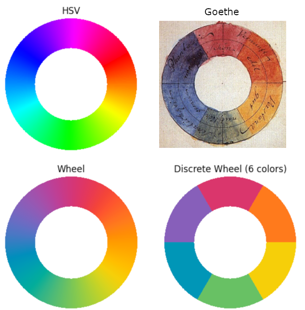
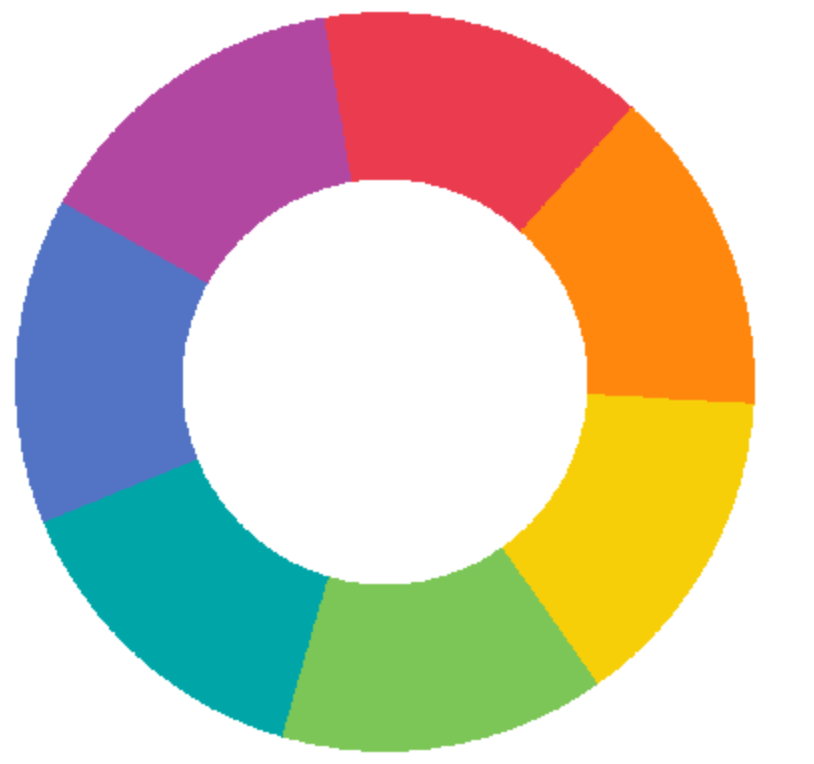

# A Color Map for the Color Wheel
This repository contains a cyclic color map, "Wheel", for the color wheel.  It is suitable for color-mapping angles. The simple "HSV" color wheel is shown for reference, and also shows several issues that the new color map is designed to correct.  
  
Figure: The basic "HSV" colormap, Goethes 1810 color wheel, the "Wheel" color map and a six uniform samples from "Wheel".  

The colormap was developed with the following goals:

* Perceptual uniformity.
* Smooth variation in luminosity and chrominance.
* Reasonable tradeoffs between high chrominance and luminosity.

The procedure involved creating a perceptually uniform colormap in the Oklab colorspace,
applying cyclic smoothing of chroma and luma and then repeating the re-parameterization for perceptual uniformity. By visual inspection is was decided that 32 color points followed by interpolation in sRGB is enough to give good final results. The color map data can be found in colormap.py in this repo.
 
A happy by-product of the procedure was that the final color map strongly resembled Goethes 1810 color wheel (see figure). It's even possible that the differences in purples is due to aging of Goethes illustration. A discrete version of the colormap using seven colors give gives particularly nice and, for most people and in most languages, unambigously named colors: red, orange, yellow, green, teal, blue and purple.  
  
Figure: Seven uniformly spaces samples from "Wheel".  
The six color version shown in the first figure has too much purple in the blue. It's not possible to correct this defect without violating preceptual uniformity.  
The Weel color map was developed by Ulf Ekström 2025.
